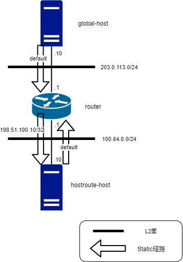

hostroute-testenv
====

/32 static-route でホストにアドレスを付けるサンプル

## Description

下記のような環境を vagrant で作り出します。ネットワーク的追加設定は vagrant provision で行っています。

## Requirement
- vagrant https://www.vagrantup.com/
- virtualbox https://www.virtualbox.org/
- vagrant image
  - centos/7 https://app.vagrantup.com/centos/boxes/7
  - higebu/vyos https://app.vagrantup.com/higebu/boxes/vyos

## Usage

TODO: 書く

## Licence

MIT

## TODO
- step-by-step で通信できるまでの段階を踏めるチュートリアル

## Author

[t-takata](https://github.com/t-takata)
